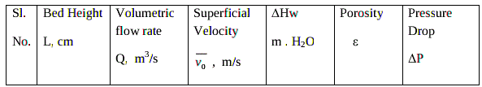
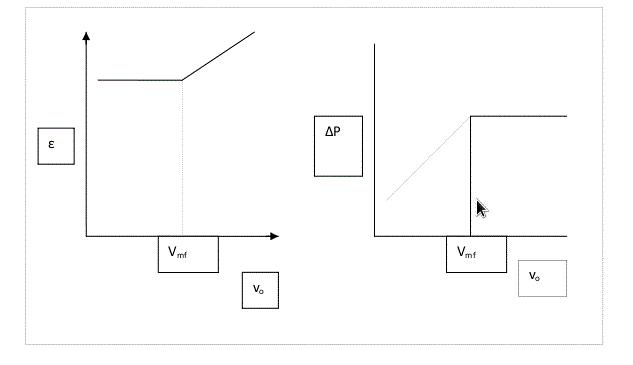

#### Apparatus required :

CCL4 manometer, Hg manometer, bucket, Stop watch.

#### Procedure :
<ol style="text-align: justify; list-style-type: number;">
<li>Keep the bypass valve open and the main valve closed. Switch on the pump.</li>
<li>Connect CCL4 manometer across the bed.</li>
<li>Allow the fluid through flow through the bed by opening the main valve.</li>
<li>Ensure for steady flow condition note down the flow rate using the rotameter .</li>
<li>The corresponding height of the bed and the difference in levels in the manometer limbs to be noted down.</li>
<li>The procedure is to be repeated for different flowrates, both for static and fluidized bed conditions.</li>
<li>Use Hg manometer for higher flow rates.</li>
<li>Collect the the fluid present in the static bed after closing the main valve, to calculate the void volume.</li>
</ol>

#### Data :

Column Diameter = D = cm 
Height of static bed = Lmf = 
Viscosity of fluid =  = cp 

Density of fluid = kg/m3 
Density of CCl4 =&nbsp;&nbsp;&nbsp;&nbsp; kg/m3 
Density of Hg = &nbsp;&nbsp;&nbsp;kg/m3 
Packing type = 
Density of packing material= p = kg/m3  
 = Sphericity =  
Specific surface area of packing = S = m2/m3=surface area/unit bed volume </b>

#### Observations :

Volume of voids = m3 

<table>
<tr>
<th>Sl No. </th>
<th>Manometer   reading    </th>
<th height="53">Height of </b>bed(L)cm </th>
<th>Rotameter reading</th>
<th>Volumetric flow  rate m3/s</th>
</tr>
<tr>
<th height="190"> </th>
<th> </th>
<th> </th>
<th> </th>
<th> </th>
</tr>
</table>

#### Calculations :
Minimum bed porosity = =void volume/volume of bed 
Volume of Bed =
 

Superficial velocity =  

Cross sectional area of the tube,  

  = m H2o 
&nbsp;m = density of manometric fluid 
=  &nbsp;&nbsp;&nbsp;    N/m2 
Bed Porocity &nbsp; 

 

Plot vs  on a log-log graph 
Plot  vs  on a log-log graph. 
Determine minimum fluidization velocity (Vmf) from both the plots. 

  
Theoretical value of minimum fluidization velocity:  
Determine pressure drop per unit bed height under minimum fluidization condition.  

  

Ergun&rsquo;s equation: 

 

Solve equation 1 and determine Vmf.

#### Results :

Report the values of minimum fluidization velocity obtained from plots and from Ergun's equation. Comment on effect of superficial velocity on  and . 
