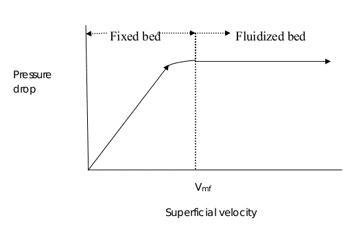
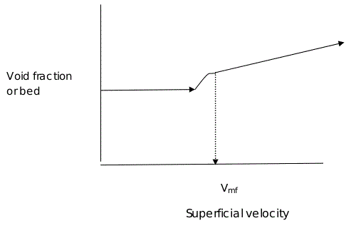

### Background and Theory :

When a liquid or a gas is passed at very low velocity up through a bed of solid
particles, the particles do not move ,and the pressure drop is given by the Ergun
equation. If the fluid velocity is steadily increased ,the pressure drop and the drag
on individual particles increase, and eventually the particles start to move and
become suspended in the fluid. The terms “fluidization” and “fluidized bed” are
used to describe the condition of fully suspended particles, since the suspension
behaves like a dense fluid.

Fluidized beds are used extensively in the chemical process industries, particularly
for the cracking of high-molecular-weight petroleum fractions. Such beds
inherently possess excellent heat transfer and mixing characteristics. These are
devices in which a large surface area of contact between a liquid and a gas ,or a
solid and a gas or liquid is obtained for achieving rapid mass and heat transfer and
for chemical reactions.</b>
The fluidized bed is one of the best known contacting methods used in the
processing industry, for instance in oil refinery plants. Among its chief advantages
are that the particles are well mixed leading to low temperature gradients, they are
suitable for both small and large scale operations and they allow continuous
processing. There are many well established operations that utilize this technology,
including cracking and reforming of hydrocarbons, coal carbonization and
gasification, ore roasting, Fisher-Tropsch synthesis, coking, aluminum production,
melamine production, and coating preparations. Nowadays, you will find fluidized
beds used in catalyst regeneration, solid-gas reactors, combustion of coal, roasting
of ores, drying, and gas adsorption operations The application of fluidization is
also well recognized in nuclear engineering as a unit operation for example, in
uranium extraction, nuclear fuel fabrication, reprocessing of fuel and waste
disposal.

When a fluid is admitted at the bottom of a packed bed of solids at a low flow rate,
it passes upward through bed without causing any particle motion. If the particles
are quite small, flow in the channels between the particles will be laminar and the
pressure drop across the bed will be proportional to the superficial velocity Vo and
for turbulent situations, pressure drop across the bed increase nonlinearly with
the increase in the superficial velocity. As the velocity is gradually increased, the
pressure drop increases, but particles do not move and the bed height remains the
same. At a certain velocity, the pressure drop across the bed counterbalances the
force of gravity on the particles or the weight of the bed, and any other further
increase in velocity causes the particles to move and the true fluidization begins.
For a high enough fluid velocity, the friction force is large enough to lift the
particles. This represents the onset of fluidization Once the bed is fluidized
pressure drop across the bed remains constant, but the bed height continues to
increase with increasing flow.

 

 

##### Minimum fluidization velocity :

To better understand fluidization of a
particle bed, it is necessary to determine what range of flow rates allow
fluidization, and also, what flow rates will begin to carry the particles out the top of
the particle chamber. It is necessary to determine a minimum flow rate allowing
the particles to become fluidized, the minimum fluidization velocity (Vmf).
This is the minimum superficial fluid velocity required for the fluidization to
occur. It can be obtained by setting the pressure drop across the bed equal to the
weight of the bed per unit area of cross section, allowing for the buoyant force of
the displaced fluid:

 
At incipient fluidization,  is the minimum void fraction 
Ergun's equation for pressure drop in packed beds can be applied to the point of
incipient fluidization and minimum fluidization velocity can be obtained by
solving the resultant quadratic equation.

The Ergun equation can be used to describe the drag exerted on a particle bed by
the fluid flow.
The Ergun equation is 

&nbsp;&nbsp;&nbsp;&nbsp;&nbsp;--------(1)
  
fp is the friction factor for a packed bed called as modified friction factor. 
Where  

&nbsp;&nbsp;&nbsp;&nbsp;&nbsp;--------(2)

  

With  = the pressure drop 
L= the height of the bed 
=the fluid viscosity 
=void fraction 
V0 = the fluid superficial velocity 
Dp =the particle diameter 
= the density of the fluid 
 = sphericity of the particle. 

By rearranging and then setting 

  

  

The Ergun equation at the point of incipient fluidization is  

  

Where, = Minimum void fraction ( before fluidization) 
Vmf= Minimum fluidization velocity 
The above equation is a quadratic in , where Vmf , the minimum fluidization
velocity.

##### Types of fluidization :

The equations derived for minimum fluidization velocity apply to liquids as
well as to gases, but beyond this velocity, the appearance of beds fluidized with
liquids or gases is often quite different. Liquid fluidized beds usually exhibit "particulate fluidization" and the gas fluidized beds exhibit "bubbling fluidization" (Refer Unit Operations of Chemical Engineering by McCabe and Smith).

